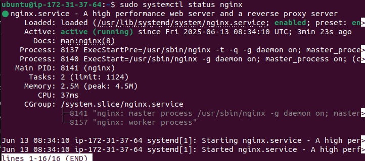
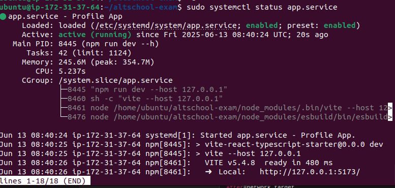
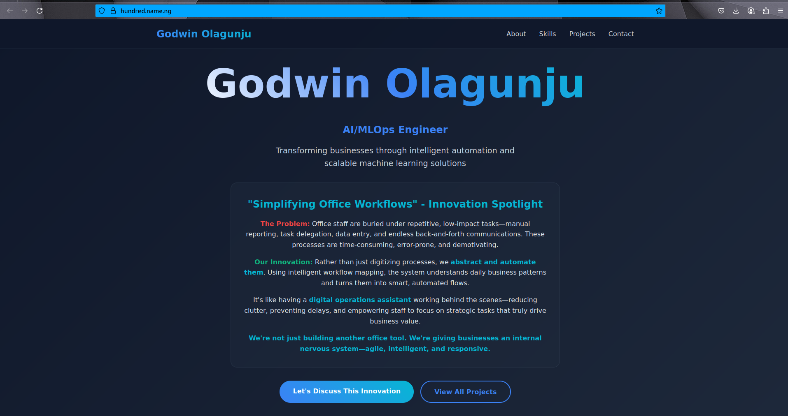
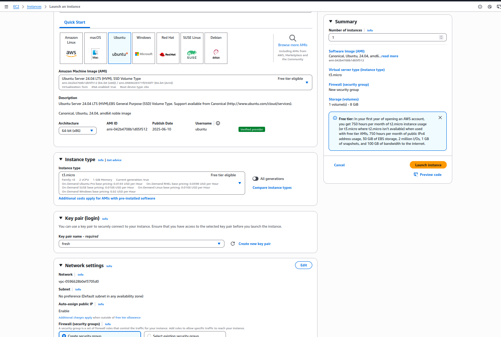

# Dynamic Web Application Deployment

## Project Overview

This project demonstrates the deployment of a dynamic web application showcasing technical skills for startup investors. The application features a personalized landing page deployed on AWS EC2 with professional-grade infrastructure including reverse proxy configuration and SSL encryption.

**Live Application**: [https://hundred.name.ng](https://hundred.name.ng)  
**Public IP**: 54.190.132.93

## Team Information

**Name**: Godwin Olagunju  
**Role**: AI/ML Engineer  
**Project**: Dynamic startup showcase web application

## Technology Stack

- **Frontend**: React with Vite
- **Web Server**: Nginx (reverse proxy)
- **Server**: AWS EC2 (Ubuntu)
- **SSL**: Let's Encrypt (Certbot)
- **Process Manager**: systemd
- **Domain**: hundred.name.ng

## Architecture

```
Internet → Domain (hundred.name.ng) → Nginx (Port 80/443) → React App (Port 5173)
```

## Deployment Steps

### 1. Server Provisioning

Deployed on AWS EC2 instance running Ubuntu with the following specifications:
- **Instance Type**: EC2 Ubuntu
- **Public IP**: 54.190.132.93
- **Domain**: hundred.name.ng

### 2. Initial Server Setup

```bash
# Update system packages
sudo apt update
```

### 3. Web Server Installation

```bash
# Install Nginx web server
sudo apt install nginx -y

# Install Node.js and npm
sudo apt install npm

# Install SSL certificate tools
sudo apt install certbot python3-certbot-nginx -y
```

### 4. Nginx Configuration (Reverse Proxy)

Created Nginx configuration for reverse proxy setup:

```bash
# Create site configuration
sudo vim /etc/nginx/sites-available/webpage
```

Configuration content:
```nginx
server {
    listen 80;
    server_name hundred.name.ng;
    
    location / {
        proxy_pass http://127.0.0.1:5173;
        proxy_set_header Host $host;
        proxy_set_header X-Real-IP $remote_addr;
        proxy_set_header X-Forwarded-For $proxy_add_x_forwarded_for;
        proxy_set_header X-Forwarded-Proto $scheme;
    }
}
```

```bash
# Enable the site
sudo ln -s /etc/nginx/sites-available/webpage /etc/nginx/sites-enabled/

# Test configuration
sudo nginx -t

# Restart Nginx
sudo systemctl restart nginx
```


### 5. SSL Certificate Setup

```bash
# Install and configure Let's Encrypt SSL certificate
sudo certbot --nginx
```

This automatically:
- Obtained SSL certificate for hundred.name.ng
- Updated Nginx configuration for HTTPS
- Set up automatic certificate renewal

## Screenshot


### 6. Application Deployment

```bash
# Clone the project repository
git clone https://github.com/Godwin-T/altschool-exam.git
cd altschool-exam

# Install dependencies
npm install
```

### 7. Process Management with systemd

Created a systemd service for application management:

```bash
# Create service file
sudo vim /etc/systemd/system/app.service
```

Service configuration:
```ini
[Unit]
Description=Profile App
After=network.target

[Service]
Type=simple
User=ubuntu
WorkingDirectory=/home/ubuntu/altschool-exam
ExecStart=/usr/bin/npm run dev -- --host 127.0.0.1
Restart=on-failure
Environment=NODE_ENV=development

[Install]
WantedBy=multi-user.target
```

```bash
# Reload systemd and start service
sudo systemctl daemon-reexec
sudo systemctl daemon-reload
sudo systemctl enable app
sudo systemctl start app
```

## Screenshot



## Security Configuration

### Firewall & Network Security
- **HTTP**: Port 80 (redirects to HTTPS)
- **HTTPS**: Port 443 (SSL encrypted)
- **SSH**: Standard port for server management

### SSL/TLS Security
- **Certificate Authority**: Let's Encrypt
- **Encryption**: Full SSL/TLS encryption
- **Auto-renewal**: Configured via Certbot

## Application Features

The landing page includes:
- **Personal Branding**: Name and professional role (AI/ML Engineer)
- **Startup Pitch**: Dynamic content showcasing innovation
- **Professional Bio**: Skills, experience, and background
- **Responsive Design**: Mobile-friendly interface
- **Modern Styling**: Professional appearance for investor presentations

## Monitoring & Maintenance

### Service Status
```bash
# Check application status
sudo systemctl statusapp

# View application logs
sudo journalctl -u app -f

# Check Nginx status
sudo systemctl status nginx
```

### SSL Certificate Renewal
```bash
# Test certificate renewal
sudo certbot renew --dry-run

# Certificates auto-renew via cron job
```

## Repository Structure

```
altschool-exam/
├── src/
│   ├── components/
│   ├── assets/
│   └── App.jsx
├── public/
├── package.json
├── vite.config.js
└── README.md
```

## Deployment Verification

### Live Application
- **URL**: https://hundred.name.ng
- **Status**: ✅ Active
- **SSL**: ✅ Secured with Let's Encrypt
- **Performance**: ✅ Optimized with Nginx reverse proxy

### Screenshot

*Professional landing page showcasing startup project and technical capabilities*



## Technical Highlights

1. **Production-Ready Infrastructure**: AWS EC2 with professional web server setup
2. **Reverse Proxy Configuration**: Nginx proxying to React development server
3. **SSL Encryption**: Full HTTPS implementation with Let's Encrypt
4. **Process Management**: systemd service for reliable application lifecycle
5. **Domain Configuration**: Custom domain with proper DNS setup
6. **Scalable Architecture**: Foundation for future enhancements and scaling

## Future Enhancements

- **Load Balancing**: Multiple application instances
- **Database Integration**: Dynamic content management
- **CI/CD Pipeline**: Automated deployment process
- **Monitoring**: Application performance tracking
- **Containerization**: Docker-based deployment

## Contact

**Godwin Olagunju**  
AI/ML Engineer  
- **Application**: https://hundred.name.ng
- **Repository**: https://github.com/Godwin-T/altschool-exam

---

*This deployment demonstrates enterprise-level web application infrastructure suitable for startup investor presentations and production environments.* 
